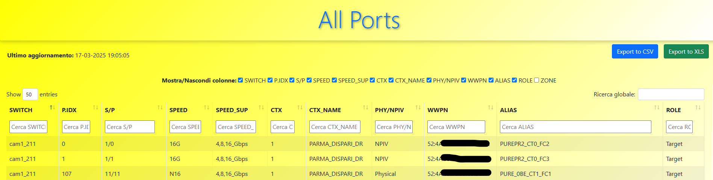

# What is SANnav App?

SANnav_app is a containerized application used to see Inventry Ports used in fabric, disovered by [Brocadee SANnav RestAPI](https://techdocs.broadcom.com/content/dam/broadcom/techdocs/us/en/pdf/fc-networking/software-sannav/sannav-240x-restapi.pdf)
The application is very simple: there is a python script that runs 2 calls to SANnav to process a summary with the most useful info.

## Prerequisites

- You have installed the latest version of [Docker Desktop](https://www.docker.com).
- You have installed a [Git client](https://git-scm.com/downloads).

## Get the app

Before you can run the application, you need to get the application source code onto your machine.

1. Clone the [sannav_app repository](https://github.com/axxx75/sannav.git) using the following command:

   ```console
   git clone https://github.com/axxx75/sannav.git 
   ```

2. View the contents of the cloned repository. You should see the following files and sub-directories.

   ```text
   ├── sannav_app/
   │ ├── .dockerignore
   │ ├── app/
   │ ├── page/
   │ ├── requirements.txt
   │ ├── httpd.conf
   │ ├── php.conf
   │ ├── supervisord.conf
   │ ├── Dockerfile   
   │ └── README.md
   ```

## Build the app's image

To build the image, you'll need to use a Dockerfile. A Dockerfile is simply a text-based file with no file extension that contains a script of instructions. Docker uses this script to build a container image.

1. In the `sannav_app` directory, the same location as the clone repository, you have `Dockerfile` configuration:

```text
FROM alpine:3.18
RUN apk update && apk add --no-cache \
    php php-cli php-phar php-json php-openssl php-mbstring php-xml php-tokenizer php-session \
    php-curl php-pdo php-pdo_mysql php-mysqli php-gd php-zip php-dom php-ctype \
    apache2 apache2-utils php-apache2 python3 py3-pip py3-virtualenv supervisor sqlite sqlite-libs sqlite-dev curl jq \
    && rm -rf /var/cache/apk/*

# Set TimeZone
RUN apk add --no-cache tzdata
ENV TZ=Europe/Rome
RUN cp /usr/share/zoneinfo/Europe/Rome /etc/localtime

# Installa requirements tramite pip
COPY requirements.txt  /app/requirements.txt
RUN pip install --no-cache-dir -r /app/requirements.txt

# Configura Apache
COPY httpd.conf /etc/apache2/httpd.conf
# Se necessario, assicurati che il modulo PHP sia abilitato in httpd.conf:
# (in Alpine, la configurazione di PHP viene solitamente inclusa automaticamente tramite i file in /etc/apache2/conf.d/)
# COPY php.conf /etc/apache2/conf.d/php.conf  <-- se volessi forzare la configurazione

# Copia le web page nel document root di Apache (di default in Alpine è /var/www/localhost/htdocs/)
ADD app/ /app
ADD page/ /page
RUN ln -s /app/sannav_pg_nodbg.py /app/sannav_pg.py

# Espone la porta: 80 per Apache e la 5001 per Flask
EXPOSE 80
EXPOSE 5001

# Imposta cron
RUN echo '*/5  *  *  *  * python /app/sannav_pg.py ' >> /etc/crontabs/root
RUN echo '10  *  *  *  * python /app/output_bk.py ' >> /etc/crontabs/root

# Eseguo la Discovery San per partire con dati nuovi e aggiornati
RUN /usr/bin/python -Wi  /app/sannav_pg.py

# Inizializzo Sqlite e carico il primo csv
RUN /usr/bin/python -Wi  /app/init_db.py
RUN /usr/bin/python -Wi  /app/carica_dati.py

# Copia il file di configurazione per Supervisor
COPY supervisord.conf /etc/supervisor/conf.d/supervisord.conf

# Avvia Supervisor che gestirà Apache, Flask e il demone cron
CMD ["/usr/bin/supervisord", "-c", "/etc/supervisor/conf.d/supervisord.conf", "-l", "/var/log/supervisord.log"]
```


   This Dockerfile starts off with a `alpine:3.18` base image, a light-weight Linux image that comes with apache and php pre-installed. 
   Then copies all of the source code into the image in htdocs directory, installs the necessary dependencies, and starts the application

2. Build the image using the following commands:

   In the terminal, make sure you're in the `sannav_app` directory. Replace `/path/to/sannav_app` with the path to your `sannav_app` directory.

   ```console
   $ cd /path/to/sannav_app
   ```

   Build the image.

   ```console
   docker build -t sannav_app .
   ```

   The `docker build` command uses the Dockerfile to build a new image. After Docker downloaded the image `alpine:3.18`, the instructions from the Dockerfile copied in your application and used `pip` to install your application's dependencies (requirements.txt).
   Finally, the `-t` flag tags your image. Think of this as a human-readable name for the final image. Since you named the image `sannav_app`, you can refer to that image when you run a container.

   The `.` at the end of the `docker build` command tells Docker that it should look for the `Dockerfile` in the current directory.

## Start an app container

Now that you have an image, you can run the application in a container using the `docker run` command.

1. Run your container using the `docker run` command and specify the name of the image you just created:

   ```console
   docker run -d -p 81:81 -p 5001:5001 --name=sannav_app --restart=always sannav_app
   ```

   The `-d` flag (short for `--detach`) runs the container in the background.
   This means that Docker starts your container and returns you to the terminal
   prompt. Also, it does not display logs in the terminal.

   The `-p` flag (short for `--publish`) creates a port mapping between the
   host and the container. The `-p` flag takes a string value in the format of
   `HOST:CONTAINER`, where `HOST` is the address on the host, and `CONTAINER`
   is the port on the container. The command publishes the container's port
   81 to `127.0.0.1:81` (`localhost:81`) on the host and port 81 and port 5001 
   for flask server. Without the port mapping, you wouldn't be able to access 
   the application from the host.

2. After a few seconds, open your web browser to [http://localhost:5001/](http://localhost:5001/).
   
   You should see your SANnav App.

   

At this point, you have a running a flask server with a sqlite for data that expose the webpage with the result of the RESTApi query to SANnav.

If you take a quick look at your containers, you should see at least one container running that's using the `sannav_app` image and on port `81 and 5001`. To see your containers, you can use the CLI or Docker Desktop's graphical interface.

Run the `docker ps` command in a terminal to list your containers.

```console
docker ps
```

Output similar to the following should appear.

```console
CONTAINER ID        IMAGE   COMMAND                 CREATED         STATUS              PORTS                                                                            NAMES
7022e015ac1c   sannav_app   "/usr/bin/supervisor…"  6 hours ago   Up 6 hours   0.0.0.0:81->81/tcp, [::]:81->81/tcp, 80/tcp, 0.0.0.0:5001->5001/tcp, [::]:5001->5001/tcp  sannav_app

```

## 🧬 Changelog

See all changes to this project in the [CHANGELOG.md](CHANGELOG.md) file.


## Reference

- [Docker file reference](https://docs.docker.com/reference/dockerfile/)
- [Docker CLI reference](https://docs.docker.com/reference/cli/docker/)
- [Brocade: Sannav Management Portal REST API and Northbound Streaming Reference Manual 2.4.0x](https://techdocs.broadcom.com/content/dam/broadcom/techdocs/us/en/pdf/fc-networking/software-sannav/sannav-240x-restapi.pdf)
- [Brocade® SANnav™ Management Portal User Guide, 2.3.x](https://techdocs.broadcom.com/content/dam/broadcom/techdocs/us/en/pdf/fc-networking/software-sannav/sannav-23x-mp.pdf)
